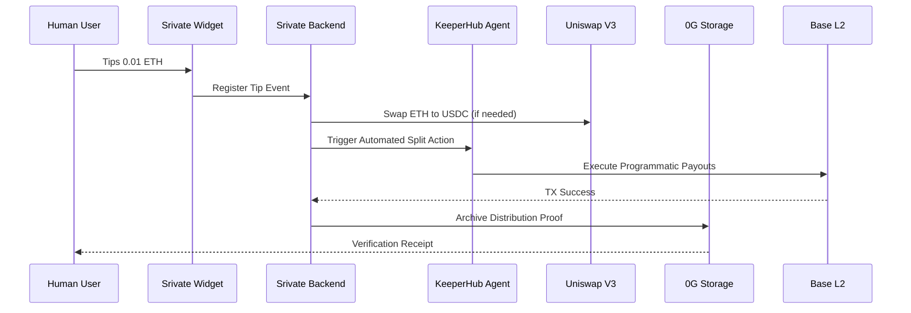
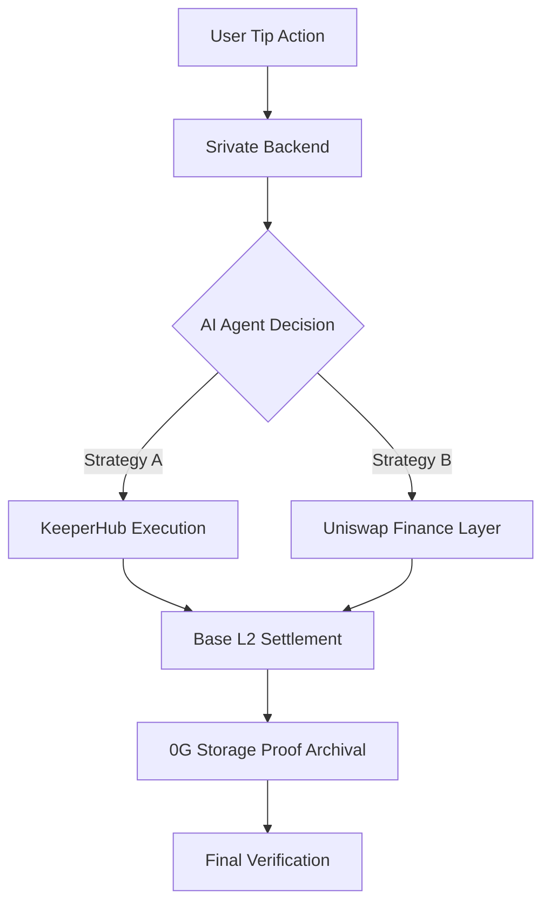

# Srivate

**Empowering Decentralized Tipping for the Agentic Web.**

Srivate is not a payment app or a wallet. 
It is a **fully modular, on-chain tipping infrastructure** designed for the next generation of autonomous agents and decentralized social ecosystems. 

Built on **Base**, Srivate combines **consumer-facing x402 flows**, **AI-driven decision logic**, and **on-chain programmatic settlement** to turn tipping into an executable, scalable on-chain action.

## Why Srivate

In the traditional web, tipping is a passive, closed-loop action (e.g., clicking a "Tip" button on a social platform). In the agentic web, tipping becomes a **programmable stimulus** that triggers complex autonomous workflows.

Current tipping systems are:
- **Fragmented**: Siloed within specific apps.
- **Manual**: Require human signatures for every small action.
- **Static**: Cannot be used as a trigger for external agents or DeFi logic.

**Srivate addresses this by redefining tipping as infrastructure, not a button.**

## What Srivate Does

Srivate manages the full lifecycle of tipping:
1. **Identification**: Detects tipping intent through widgets or social social triggers.
2. **Splitting**: Uses AI and smart contracts to split tips between multiple contributors (e.g., the original creator, the agent developer, and the hosting platform).
3. **Settlement**: Programmatically settles payouts on-chain via the **Base L2**.
4. **Execution**: Triggers external agent actions (via KeeperHub) or DeFi swaps (via Uniswap) based on the tip amount.
5. **Trust**: Archives a permanent proof of distribution on **0G Storage**.

## Core Stack (The Modular Engine)

Srivate is designed as a layered infrastructure:

- **Application Layer**: Agentic UX and Tipping Widgets.
- **Execution Layer (KeeperHub)**: Programmatic transaction execution for agents.
- **Finance Layer (Uniswap)**: Intelligent token distribution and liquidity swaps.
- **Trust Layer (0G Storage)**: Decentralized, verifiable proof of distribution.
- **Settlement Layer (Base)**: High-speed, low-cost L2 settlement.

---

## Technical Flow

### Tipping Lifecycle

### Modular Splitting Logic
**Srivate separates responsibilities by design:**
1. **Intent Capture**: Capture user tips via x402-ready interfaces.
2. **AI Decisioning**: Determine the split ratio based on agent logic.
3. **Trustless Settlement**: Ensure every participant gets their share without manual intervention.

## Srivate Flow (Infrastructure & Trust Perspective)

## Network Support
Srivate operates on the **Base** blockchain.

## Why it matters for Hackathons
* **Modular**: Easy to plug into any agentic app.
* **Composable**: Works with Uniswap, KeeperHub, and 0G out of the box.
* **Developer First**: Srivate is designed as infrastructure-first, UI-second.

---

© 2024 Srivate Protocol. Built for ETHGlobal Open Agents.
