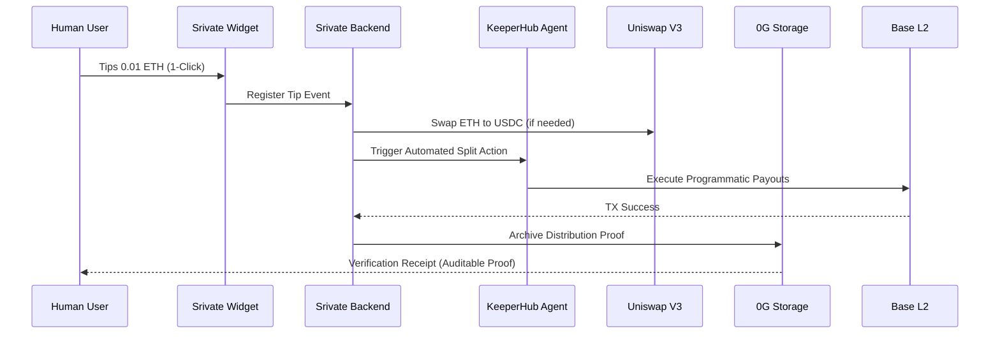
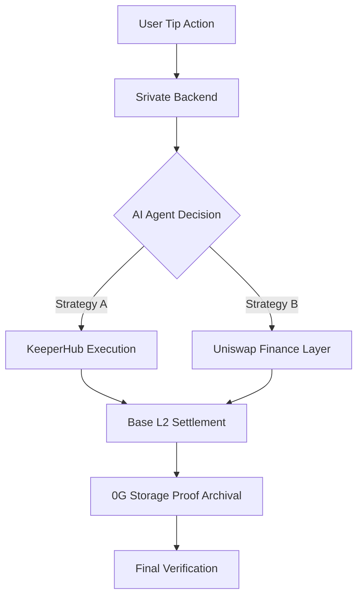

# SRIVATE

**The Trustless Tipping Infrastructure for the Agentic Web.**

Srivate (formerly conceptualized as Weep/Tink) is not just a payment app or a wallet. It is a **fully modular, on-chain tipping infrastructure** designed to solve the structural flaws of the modern digital tipping market and empower the next generation of autonomous agents and decentralized ecosystems.

Built on **Base**, Srivate combines **consumer-facing x402 flows**, **AI-driven decision logic**, and **on-chain programmatic settlement** to turn tipping into a transparent, scalable, and executable on-chain action.

---

## The Market Problem: Why Focus on Tipping?

The transition from physical cash to digital payments has fundamentally shifted tipping culture. However, this transition has introduced severe structural friction:

1. **For Consumers (Friction & Decision Fatigue)**: The traditional "Tip" button is a passive, closed-loop action. Users face decision fatigue over how much to tip and privacy concerns regarding payment data.
2. **For Service Providers & Workers (Trust & Transparency)**: There is a massive lack of trust. Do the tips actually go to the workers? Current systems are opaque, and settlements are heavily delayed.
3. **For Businesses (Inefficiency)**: Routing, splitting, and managing taxes for tips is highly complex and manual.

**Current tipping systems are fragmented, manual, and static.** They cannot be used as a trigger for external agents or DeFi logic. Srivate addresses this by redefining tipping as **infrastructure, not a button.**

---

## The Srivate Solution

Srivate manages the full lifecycle of a tip by providing a standardized protocol for micro-value transfers:

1. **Frictionless Initiation**: A one-click embedded widget designed around the **x402 standard**, reducing user friction.
2. **AI-Driven Intelligence**: An AI engine that recommends optimal tip amounts based on context, eliminating decision fatigue.
3. **Trustless Splitting**: Uses smart contracts to instantly split tips between multiple contributors (e.g., the original creator, the agent developer, and the hosting platform) with zero manual intervention.
4. **Verifiable Trust**: Archives a permanent, auditable proof of distribution on **0G Storage**, guaranteeing that the intended recipient received the funds.
5. **Agentic Execution**: Programmatically triggers external agent actions (via **KeeperHub**) or DeFi swaps (via **Uniswap**) based on the tip event.

---

## Core Stack (The Layered Architecture)

Srivate is designed as a highly modular layered infrastructure:

- **Application Layer (Initiation)**: Agentic UX and Tipping Widgets.
- **Intelligence Layer**: AI-driven context and amount recommendations.
- **Execution Layer (KeeperHub)**: Programmatic transaction execution for agents.
- **Finance Layer (Uniswap)**: Intelligent token distribution and liquidity swaps.
- **Settlement Layer (Base)**: High-speed, low-cost L2 settlement for atomic payouts.
- **Trust Layer (0G Storage)**: Decentralized, verifiable proof of distribution.

---

## Technical Flow

### Tipping Lifecycle

### Modular Splitting Logic
**Srivate separates responsibilities by design:**
1. **Intent Capture**: Capture user tips via x402-ready interfaces.
2. **AI Decisioning**: Determine the split ratio based on agent logic.
3. **Trustless Settlement**: Ensure every participant gets their share without manual intervention.

## Srivate Flow (Infrastructure & Trust Perspective)

---

## Why it matters for Hackathons
* **Modular**: Easy to plug into any agentic app or physical point-of-sale interface.
* **Composable**: Works with Uniswap, KeeperHub, and 0G out of the box.
* **Developer First**: Srivate is designed as infrastructure-first, UI-second, offering a robust backend for the future of the tipping economy.

---

© 2024 Srivate Protocol. Built for ETHGlobal Open Agents.
